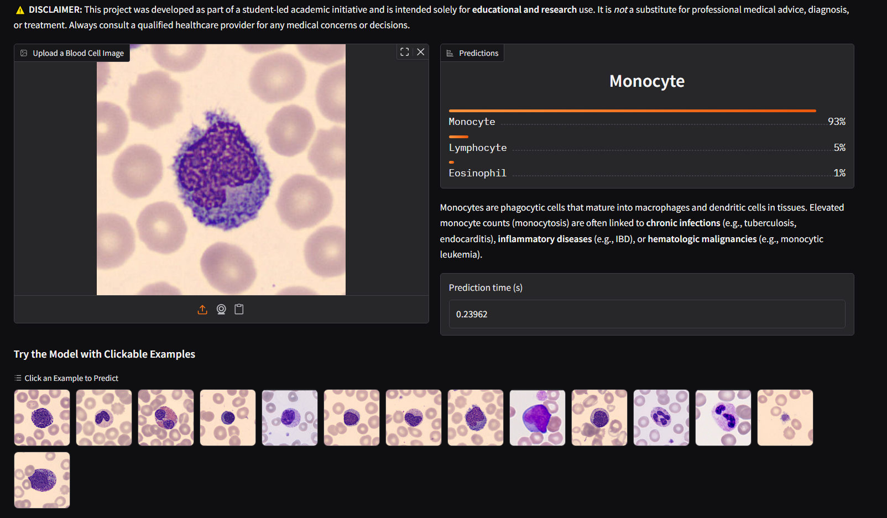
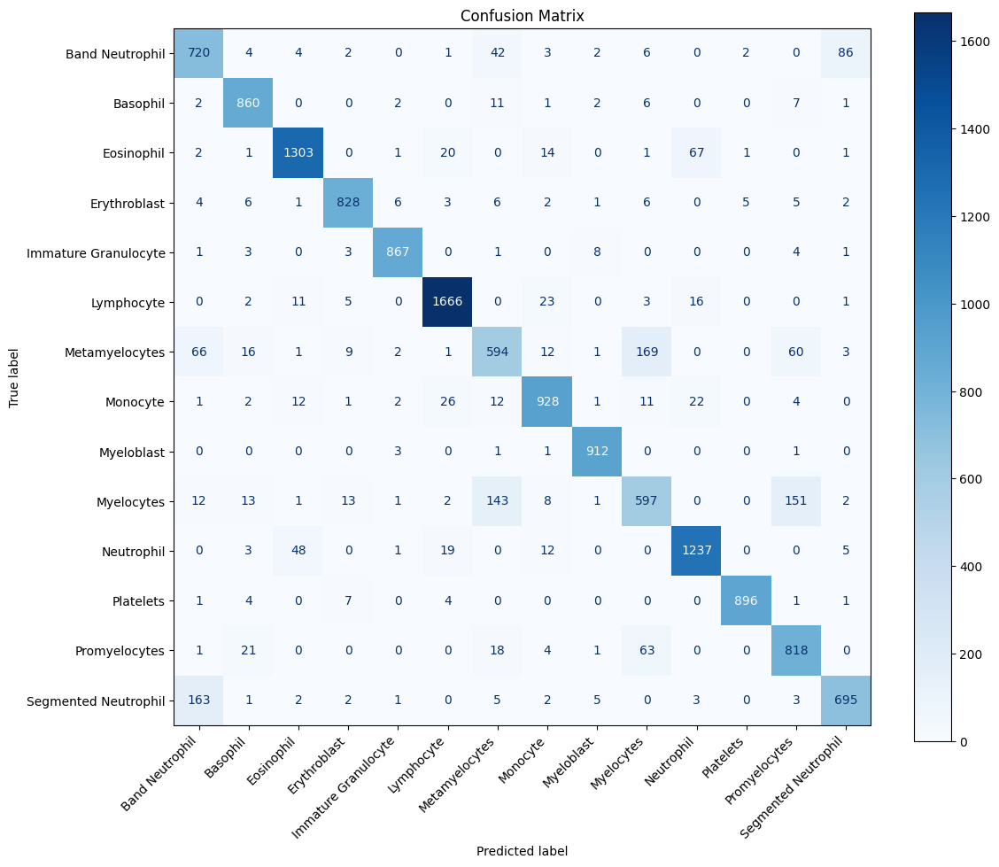

# [🧫 CelluScan: Automated Blood Cell Classification with Vision Transformer](https://huggingface.co/spaces/Youssef-omarr/CelluScan)

CelluScan is a custom Vision Transformer (ViT)–based pipeline for classifying white blood cell (WBC) subtypes and detecting abnormalities. Trained on \~60,000 curated images, the model achieves 88.93% test accuracy and is deployed as a service.



---

## Repository Structure

```
CelluScan/
├── Blood cells datasets/        # Folders of all classes (with one image as an example)
│
├── Extra info/                  # Supplementary research and technical notes
│   ├── MultiHead_Self_Attention.md   # Notes on attention mechanisms
│   └── Researches.md                # Literature and research summaries on the blood cells
│
├── Outputs/                     # Model outputs, confusion matrices, and logs
│   ├── Cmatrix_after_7_EPOCHS.png         # Confusion matrix after 7 epochs
│   ├── Cmatrix_after_another_5_EPOCHS.png # Confusion matrix after additional epochs
│   ├── losses_after_7_EPOCHS.png          # Loss curves after 7 epochs
│   └── losses_after_another_5_EPOCHS.png  # Loss curves after additional epochs
│
├── AN IMAGE IS WORTH 16X16.pdf  # Reference paper on Vision Transformers
├── CelluScan.ipynb              # Main Jupyter notebook for model training and evaluation
└── final_fine_tuning.ipynb      # Notebook for final model fine-tuning
```

---

## Table of Contents

1. [Overview](#overview)
2. [Dataset & Preprocessing](#dataset--preprocessing)
3. [Model Architecture](#model-architecture-vision-transformer-vit-b16)
4. [Training Procedure](#training-procedure)
5. [Results & Discussion](#results--discussion)
6. [License](#license)

---

## Overview

* **Goal**: Classify 14 WBC categories (e.g., Neutrophils, Lymphocytes) and identify developmental stages (e.g., Promyelocyte, Myelocyte).
* **Approach**: Transfer learning using PyTorch’s pretrained ViT-B/16, extended with custom classification heads and attention modules. Scratch training remains available but is resource-intensive.

> **Note:** On the [Hugging Face website](https://huggingface.co/spaces/Youssef-omarr/CelluScan), you can also view potential diagnoses and interesting facts about each cell type alongside the model predictions.

Thanks for the clarification. Since the \~60,000 images are **after** duplicate removal and class balancing (via augmentation), here's an accurate and cleaned-up version of the section reflecting the correct order of processing:

---

##  Dataset & Preprocessing

* **Final Dataset Size**: \~60,000 images across **14 blood cell classes**, **after cleaning, deduplication, and class balancing**.

###  Data Cleaning & Verification

Before augmentation and training, the dataset underwent multiple cleaning and validation steps to ensure data quality:

* **Label Correction & Verification**:
  	1.	Domain Understanding:
Conducted in-depth research on hematological cell types to gain a solid understanding of class distinctions and data characteristics.
	2.	Expert Validation:
Consulted a clinical pathology specialist to confirm the accuracy of class definitions and reinforce the reliability of the dataset.
	3.	Data Collection:
Aggregated cell images from multiple open-source datasets to build a diverse and representative dataset.
	4.	Manual Labeling & Organization:
Manually reviewed and sorted each image into its corresponding class folder, ensuring consistent labeling. Each class was assigned a unique prefix (e.g., BNE for Band Neutrophils, MMY for Myelocytes, PMY for Promyelocytes) for clarity and traceability.

* **Image Normalization**:

  * All images resized to **224×224**, padded if necessary to maintain aspect ratio.
  * Normalized using channel-wise mean and standard deviation computed from the cleaned dataset.

---

###  Class Balancing (Post-Cleaning)

After cleaning, the class distribution remained highly imbalanced (e.g., only 151 **Immature Granulocytes** vs. 8,685 **Lymphocytes**). To address this:

* **Balancing Strategy**:

  * Minority classes were augmented using `TrivialAugmentWide` until each class had at least **4,500 samples**.
  * Majority classes were left unaugmented to preserve their original distribution.
  * No synthetic duplication — all augmented images were **transformed variants**, not raw copies.

---

###  Dataset Splits

* **5%** — Reserved for **sanity checks**, augmentation validation, and early debugging.
* **20%** — Used during **hyperparameter tuning** and performance tracking.
* **100%** — Used for **final training phase**, once architecture and parameters were locked in.

| Class                | Original | Post-Balance |
| -------------------- | -------: | -----------: |
| Immature Granulocyte |      151 |        4,500 |
| Promyelocyte         |      592 |        4,500 |
| Myeloblast           |    1,000 |        4,500 |
| Metamyelocyte        |    1,015 |        4,500 |
| Myelocyte            |    1,137 |        4,500 |
| Erythroblast         |    1,551 |        4,500 |
| Band Neutrophil      |    1,634 |        4,500 |
| Basophil             |    1,653 |        4,500 |
| Platelet             |    2,348 |        4,500 |
| Segmented Neutrophil |    2,646 |        4,500 |
| Monocyte             |    5,046 |        5,046 |
| Neutrophil           |    6,779 |        6,779 |
| Eosinophil           |    7,141 |        7,141 |
| Lymphocyte           |    8,685 |        8,685 |


--- 

##  Model Architecture: Vision Transformer (ViT-B/16)

We faithfully re-implemented the Vision Transformer architecture as introduced in [*An Image is Worth 16x16 Words*](https://arxiv.org/abs/2010.11929), ensuring full compatibility with PyTorch’s pretrained ViT-B/16 weights. In particular, we manually implemented the **Multi-Head Self-Attention (MSA)** mechanism based on the original formulation from [*Attention is All You Need*](https://arxiv.org/abs/1706.03762), giving us low-level control over the attention computations. Our modular design also allows **training from scratch** and supports ablation studies or architecture modifications.

> Note: Training a large Vision Transformer from scratch is resource-intensive and time-consuming. While we built the full architecture manually as an educational exercise, for practical purposes, we use PyTorch’s pretrained ViT-B/16 and apply transfer learning due to limited compute resources.


###  Architecture Overview

| Component               | Details                                                                                                     |
| ----------------------- | ----------------------------------------------------------------------------------------------------------- |
| **Input**               | RGB image, resized to `224×224`                                                                             |
| **Patch Embedding**     | Image split into `16×16` patches → 196 patches → each mapped to `768`-dim vectors                           |
| **Tokenization**        | Prepend learnable `[CLS]` token → sequence becomes `197×768`                                                |
| **Positional Encoding** | Learnable 1D embedding added to maintain spatial order                                                      |
| **Transformer Encoder** | 12 layers, each with:<br>• 12-head self-attention<br>• MLP with 3072 hidden units<br>• LayerNorm, Residuals |
| **Classification Head** | Output from `[CLS]` token → LayerNorm → Linear layer → 14 output classes                                    |

---

###  Key Architectural Components (Custom-Built)

We re-implemented each module of ViT manually to better understand the internals and to maintain flexibility.

####  1. Patch Embedding

* Converts the image into non-overlapping patches using a Conv2D layer (kernel=patch\_size, stride=patch\_size).
* Output flattened into a 1D sequence of shape `(batch_size, num_patches, embedding_dim)`.
* This replaces the need to manually extract and flatten image patches.

####  1.1. \[CLS] Token & Position Embedding

* A learnable `[CLS]` token is prepended to the patch sequence, representing the whole image.
* Positional embeddings are learnable parameters of shape `(1, 197, 768)` and are added to the input sequence.
* Helps retain positional context, as transformers are permutation-invariant.

---

####  2. Transformer Encoder Block

Each of the 12 blocks includes:

#### 2.1. **Multi-Head Self-Attention (MSA)**:
  * Queries, Keys, and Values are projected via linear layers, split into 12 heads.
  * Attention computed as scaled dot-product, results concatenated and linearly projected.

#### 2.2. **MLP Block**:
  * 2-layer feedforward network: `Linear(768 → 3072) → GeLU → Dropout → Linear(3072 → 768)`.

#### 2.3. **Residual Connections & Layer Normalization**:
  * Both attention and MLP blocks are wrapped in `LayerNorm + residual` to stabilize gradients and learning.

---

#### 3. MLP Classification Head

* Final `[CLS]` token output is normalized via `LayerNorm` and passed through a `Linear(768 → 14)` layer for classification.

---

### Transfer Learning Compatible

While we re-implemented the Vision Transformer architecture primarily for learning purposes, our custom model is **not identical** to `torchvision.models.vit_b_16`, and **cannot load its pretrained weights directly**.

For practical usage, we created an instance of PyTorch’s official `vit_b_16` model, loaded the `DEFAULT` weights, and fine-tuned it using our dataset. This allowed us to take full advantage of pretrained weights without the extreme computational cost of training our custom ViT from scratch — which would have required **significant GPU resources and time**.

> **Note:** The custom implementation remains fully functional and trainable, but was primarily built for architectural understanding, experimentation, and ablation — not for production-scale use.


### Summary of Configuration

| Parameter          | Value       |
| ------------------ | ----------- |
| Patch Size         | 16×16       |
| Num Patches        | 196         |
| Embedding Dim      | 768         |
| Num Layers (Depth) | 12          |
| Num Heads          | 12          |
| MLP Hidden Dim     | 3072        |
| Dropout            | 0.1         |
| Input Size         | 224×224 RGB |
| Output Classes     | 14          |

---


## Training Procedure

1. **Data Splits**:

   * 5% (\~3K images, 5 epochs)
   * 20% (\~12K images, 7 epochs)
   * 100% (\~60K images, 7 + 5 epochs)
2. **Optimizer**: `torch.optim.AdamW(vit.parameters(), lr=3e-4, weight_decay=1e-2)`
3. **Loss**: `torch.nn.CrossEntropyLoss()`
4. **Metrics**: `torchmetrics.Accuracy(task="multiclass", num_classes=14)`

---

## Results & Discussion



* **Overall Test Accuracy**: 88.93% on full dataset.

---

###  **Class-wise Challenges & Biological Overlap**

#### > **Metamyelocytes vs. Myelocytes vs. Promyelocytes**
  These are all stages of **granulocytic precursor cells** in the process of **myelopoiesis** (formation of granulocytes in bone marrow).

  * **Biological similarity**:

    * All three originate from the **myeloblast** and share similar **cytoplasmic granulation**, **nuclear shape**, and **cell size**.
    * **Promyelocytes** have large nuclei with prominent nucleoli and azurophilic granules.
    * **Myelocytes** begin to show specific granules, but the **nucleus is still round or oval**.
    * **Metamyelocytes** have a **kidney-shaped nucleus**, but this can overlap morphologically with late-stage myelocytes.
    * These subtle morphological shifts are difficult to pick up even for trained specialists, let alone models.
  * ❗️**Why it's hard for the model**:
    Visual cues are extremely nuanced; the key distinguishing feature is **nuclear shape**, which can be ambiguous due to staining variations, orientation of cells, or image resolution.
  * ❓**How doctors differentiate**:
    Experts rely on **nuclear indentation**, **granule distribution**, and **contextual clues** within the smear. Sometimes they even need **serial sectioning** or **manual review under multiple fields** for reliable classification.

---

#### > **Band vs. Segmented Neutrophils**
  These are successive stages in **neutrophil maturation**.

  * **Biological similarity**:

    * Both share identical cytoplasm and granules.
    * The **only major difference** is in the **nuclear segmentation**:

      * **Bands** have a **non-segmented curved nucleus** (like a U or S shape).
      * **Segmented neutrophils** have **2-5 distinct nuclear lobes** connected by thin filaments.
    * However, the boundary between the two is **not discrete** and is more of a **developmental continuum**.
  * ❗️**Why it's hard for the model**:
    If the image captures the cell in a way that obscures the nucleus or if the segmentation is subtle, the distinction becomes visually blurred.
  * ❓**How doctors differentiate**:
    Professionals use a combination of **nuclear shape**, **chromatin pattern**, and **experience-based thresholds** (e.g., how narrow is the filament between lobes) to label them.

---

#### > **Eosinophils vs. Neutrophils**
  Though from the same granulocyte lineage, these two are often misclassified due to overlapping features under certain conditions.

  * **Biological similarity**:

    * Both have **bilobed nuclei** and similar cell sizes.
    * When eosinophilic granules are faint or obscured (due to poor staining or artifacts), eosinophils may resemble neutrophils.
    * In addition, **toxic granulation** or artifacts in neutrophils can mimic eosinophilic granularity.
  * ❗️**Why it's hard for the model**:
    The model relies heavily on **granule color and density**, which can vary depending on **slide preparation, lighting, or camera calibration**.
  * ❓**How doctors differentiate**:
    Eosinophils have **distinct reddish-orange granules** (acidophilic), whereas neutrophils have **finer, lilac or pinkish granules**. Human experts also take into account **clinical context**, which AI lacks.

---

Despite these challenges, the model demonstrates robust performance for automated screening; further chemical staining data could bolster clinically critical distinctions.

---

## License

Licensed under the MIT License. See [LICENSE](LICENSE) for details.
